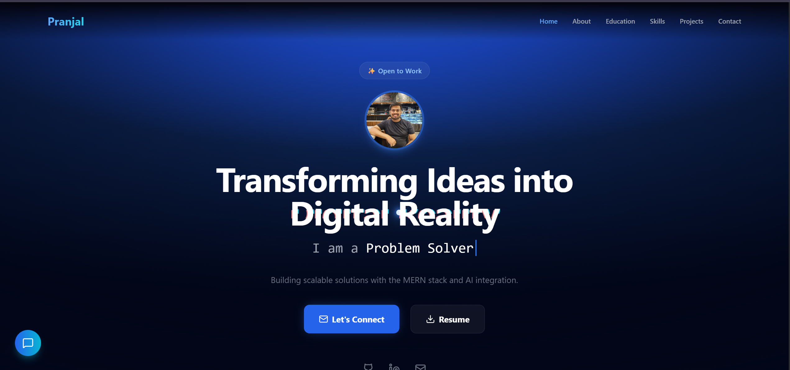
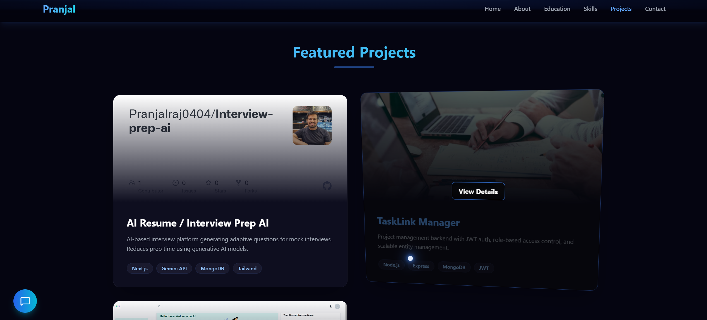
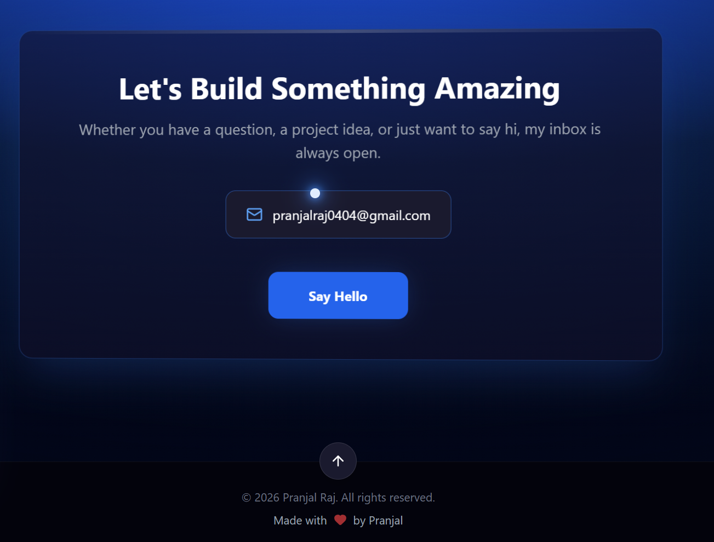
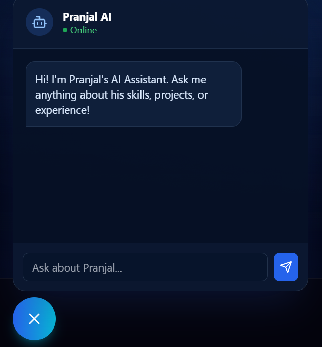

# PR.DEV – Full Stack Developer Portfolio

A modern, animated, and AI-powered **full-stack developer portfolio** built using React, Vite, Tailwind CSS, Supabase, EmailJS, and Gemini AI.

Showcases projects, skills, journey, and includes a live **AI assistant**, Supabase-hosted assets, and a fully functional contact system.

---

## 🔗 Live Demo

👉 **Hosted on Vercel:**  

https://portfolio-pranjalraj.vercel.app/

---

## 🖼️ Screenshots

Your screenshots are stored in the `public/` folder.

### 🔹 Hero Section


### 🔹 Featured Projects


### 🔹 Contact Modal


### 🔹 AI Chatbot



## ✨ Features

- 🎨 **Modern Glassmorphism UI**: High-end visuals with gradients, backdrop blur, custom cursor, and smooth scroll animations.
- 🧑‍💻 **Interactive Hero Section**: Features glitch text effects, typewriter animations, and a dynamic layout.
- 🧰 **Categorized Tech Stack**: Visual breakdown of skills (Languages, Frontend, Backend, Tools) with hover effects.
- 💼 **Project Showcase**:
  - Detailed project cards with tech badges.
  - **AI "Explain Like I'm 5"**: Uses Google Gemini API to simplify technical descriptions instantly.
  - Direct links to GitHub and Live Demos.
- 📂 **Supabase Storage**: Efficiently hosts profile images and resume files.
- 📬 **Smart Contact System**:
  - Powered by EmailJS.
  - Sends inquiries directly to your inbox.
  - Auto-replies to senders with a confirmation message.
- 🤖 **"Pranjal AI" Chatbot**: A custom-trained AI assistant that answers questions about the portfolio owner's skills and background.
- 📱 **Fully Responsive**: Optimized for all devices, from mobile phones to large desktop screens.
- ⚡ **High Performance**: Built with Vite for lightning-fast loading and HMR.
- 🚀 **CI/CD Deployment**: Automated deployments to Vercel via GitHub.

---

## 🛠 Tech Stack

**Frontend**  
- React  
- Vite  
- Tailwind CSS  
- Lucide Icons  

**Services**  
- Supabase (Storage)  
- EmailJS (Contact Form)  
- Google Gemini API (AI Features)  

**Deployment**  
- Vercel  

---

## 📁 Project Structure

The project follows a modular architecture for better maintainability and scalability:

```bash
my-portfolio/
├── public/                 # Static assets (images, icons)
│   ├── Hero Section.png
│   ├── Featured Projects.png
│   ├── Contact Modal .png
│   ├── AI Chatbot .png
│   └── vite.svg
├── src/
│   ├── assets/             # Component-specific assets
│   ├── components/         # Reusable UI components
│   │   ├── layout/         # Structural components (Navbar, Footer)
│   │   ├── modals/         # Popup modals (Project, Contact)
│   │   ├── sections/       # Page sections (Hero, About, Projects, etc.)
│   │   ├── ui/             # Generic UI elements (Buttons, Cards, Loaders)
│   │   └── widgets/        # Standalone widgets (AIChatWidget)
│   ├── data/               # Static data files (portfolioData.jsx)
│   ├── hooks/              # Custom React hooks (useScrollReveal, etc.)
│   ├── utils/              # Utility functions & config (API, constants)
│   ├── App.jsx             # Main application component
│   ├── App.css             # Global styles
│   ├── index.css           # Tailwind & base styles
│   └── main.jsx            # Entry point
├── .gitignore
├── index.html
├── package.json
├── vite.config.js
├── tailwind.config.js
└── postcss.config.js
```


⚙️ Environment Variables

Create a .env file in the project root:

``` bash
VITE_SUPABASE_URL=your_supabase_url
VITE_SUPABASE_ANON_KEY=your_supabase_anon_key

VITE_EMAILJS_SERVICE_ID=your_emailjs_service_id
VITE_EMAILJS_YOUR_TEMPLATE_ID=your_main_template_id
VITE_EMAILJS_AUTOREPLY_TEMPLATE_ID=your_autoreply_template_id
VITE_EMAILJS_PUBLIC_KEY=your_emailjs_public_key

VITE_GEMINI_API_KEY=your_gemini_api_key
```


**Important**

All keys must start with VITE_ (Vite requirement).

.env is ignored by git (via .gitignore) → secrets are safe.

Add the same keys in Vercel → Project → Settings → Environment Variables.

🚀 Running Locally
1️⃣ Clone the repo
```bash
git clone https://github.com/Pranjalraj0404/Portfolio.git
cd Portfolio
```

2️⃣ Install dependencies
```bash
npm install
```

3️⃣ Setup .env
```bash
Create .env with the values shown above.
```

4️⃣ Start dev server
```bash
npm run dev
```

Open: http://localhost:5173

5️⃣ Build & preview production build
```bash
npm run build
npm run preview


Preview: usually http://localhost:4173
```

🌐 Deploying to Vercel

Push to GitHub (steps below).

On Vercel Dashboard:
```bash
Import Portfolio repo from GitHub

Framework preset: Vite

Build command: npm run build

Output directory: dist

Add all environment variables

Click Deploy 🚀

Every push to main will auto-redeploy.
```
🧾 Git & GitHub Workflow

From inside your project folder (D:\Projects\gemin\my-portfolio):
```bash
First time (already done, but for reference)
git init
git branch -M main
git remote add origin https://github.com/Pranjalraj0404/Portfolio.git
git add .
git commit -m "Initial commit"
git push -u origin main
```

Next updates (like this README + screenshots)

Whenever you change files (README, images, code):

```bash
# 1. See what changed
git status

# 2. Stage all changes
git add .

# 3. Commit with a message
git commit -m "Add README and screenshots"

# 4. Push to GitHub
git push
```

That’s it – Vercel will pick up the push and redeploy automatically.

🤝 Contributing / Reuse

You can:

Fork this repo

Replace content with your own details

Swap services (e.g., different AI provider or backend)

Extend the AI assistant or add new sections

📜 License

This project is open for personal portfolio use.
Feel free to learn from it and build your own version.

🙌 Credits

Developer: Pranjal Raj

Hosting: Vercel

Icons: Lucide

Devicons: cdn.jsdelivr.net/gh/devicons/devicon

AI: Google Gemini

Storage: Supabase
